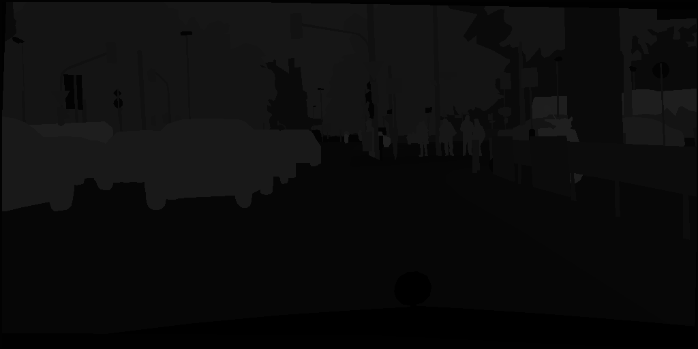
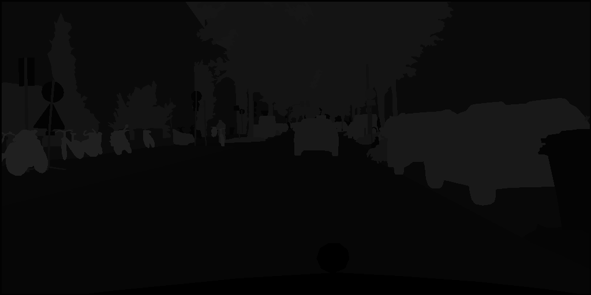
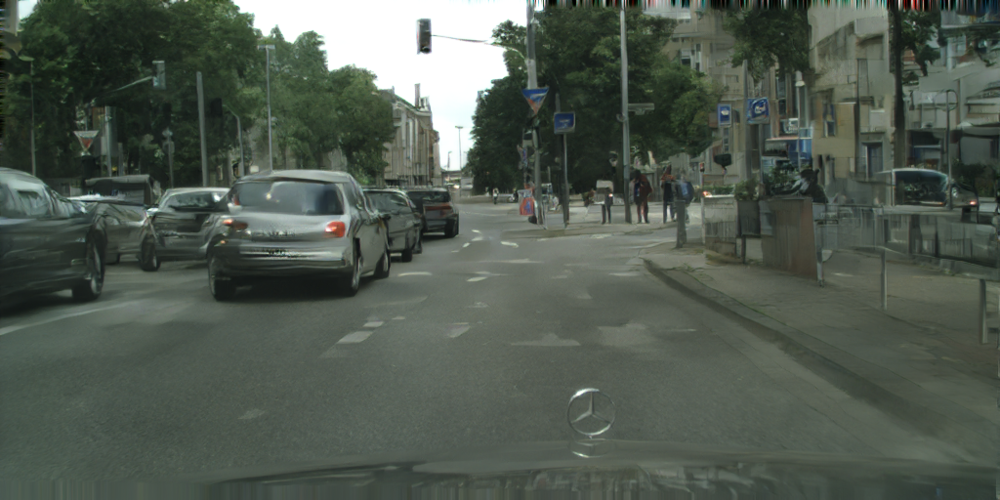
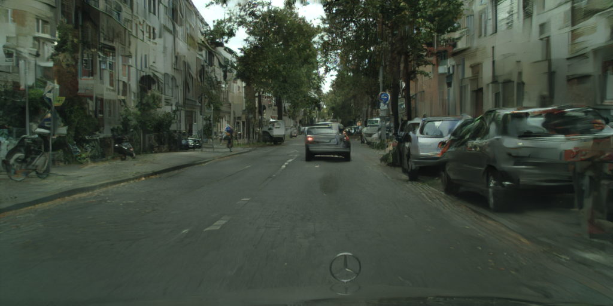
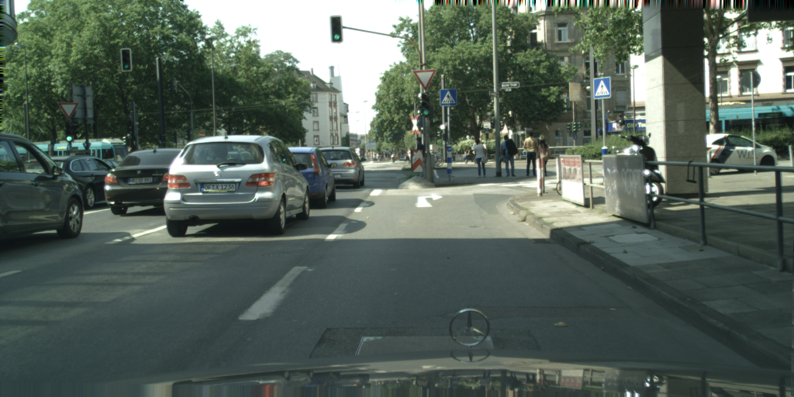
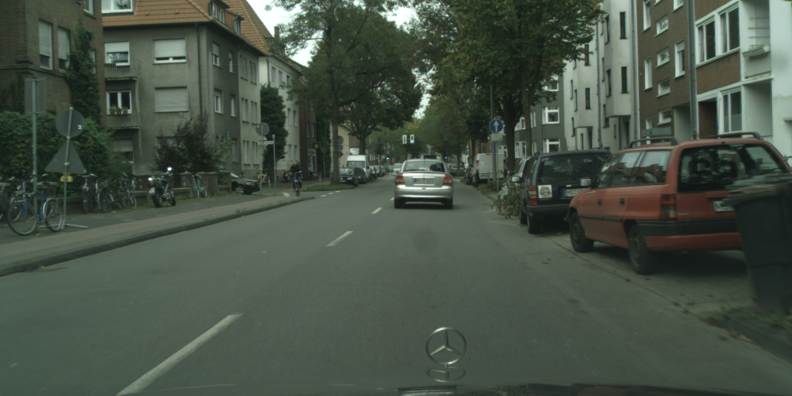

# chainer-pix2pixHD
Chainer implementation of pix2pixHD
https://github.com/NVIDIA/pix2pixHD. This version does not (yet) implement instance labels or VGG feature loss.

# Example
<table style="width:100%">
 <tr>
  <th></img></th>
  <th></img></th>
 </tr> 
  <tr>
  <th></img></th>
  <th></img></th>
 </tr> 
  <tr>
  <th></img></th>
  <th></img></th>
 </tr> 
</table>

# Setup
* `pip install -r requirements.txt`
* `conda install -c menpo opencv3=3.1.0`
* `pip install -U git+https://github.com/mcordts/cityscapesScripts.git` (in order to use the cityscapes dataset properly)

# Usage
* To reproduce the results on cityscapes at `512x1024` resolution, first pretrain the global generator at `256x512`:
  * `python tools/train.py -g <gpu> -G GlobalGenerator -o out/pretrained_global/ --config configs/cityscapes_256.json`
* Then tune the full model at `512x1024` using the results of the pretraining;
  * `python tools/train.py -g <gpu> -G MultiScaleGenerator -o out/total/ --global_generator_model out/pretrained_global/generator_model_200 --fix_global_num_epochs 10 --config configs/cityscapes_512.json`
  
Note that you will require a GPU with at least 16Gb of VRAM to train for image size `512x1024`. The results shown here were trained on a Tesla P100.  

# Multi-GPU training
* You can use [ChainerMN](https://github.com/chainer/chainermn) for multi-GPU training. Please install ChainerMN in order to use it. The following command illustrates usage:
* `mpiexec -n 4 python tools/train.py -g 0 1 2 3 ...`
* where we have specified 4 workers and the individual GPU ids
* note that this is the equivalent of having a batchsize of 4. The argument `-b` will specify the batchsize of each worker, so the effective batchsize is multiplied by the number of workers.